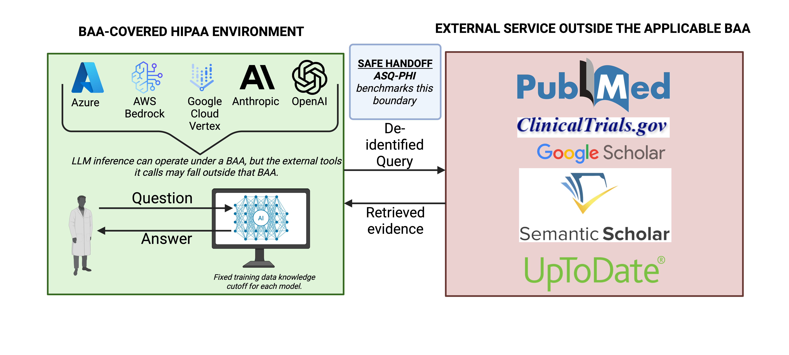
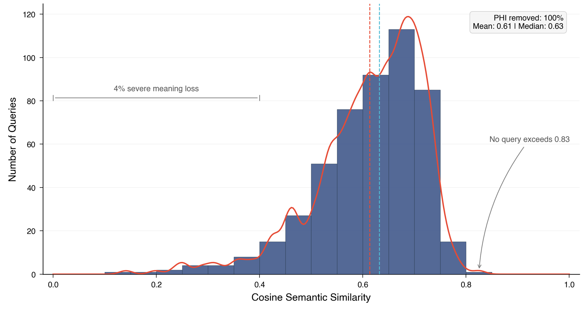
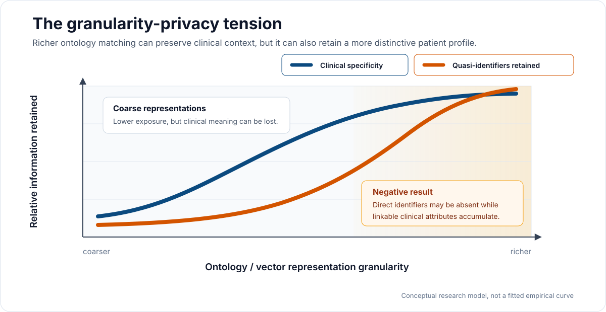

# SafeSearch

James Charl Weatherhead · Jake Craig Weatherhead · Peter A. McCaffrey, MD (PI)

**SafeSearch is a constrained semantic reconstruction gateway that connects BAA-covered clinical LLM environments to external web search without intentionally exposing protected health information (PHI).** Rather than redacting identifiers from the clinician's original question, SafeSearch decomposes the question into clinical concepts, maps those concepts onto a controlled clinical vocabulary, reconstructs a new task-oriented query, and sends that reduced representation across the trust boundary for external evidence retrieval.

## The boundary problem



The [Health Insurance Portability and Accountability Act of 1996 (HIPAA)](https://www.hhs.gov/hipaa/index.html) establishes federal requirements governing the privacy and security of **protected health information (PHI)** handled by regulated healthcare organizations. Under the HIPAA Rules, covered entities include health plans, healthcare clearinghouses, and certain healthcare providers; organizations performing functions or services on their behalf that involve creating, receiving, maintaining, or transmitting PHI may become **business associates**. [[HHS: Covered Entities and Business Associates](https://www.hhs.gov/hipaa/for-professionals/covered-entities/index.html)] [[HHS: Business Associates](https://www.hhs.gov/hipaa/for-professionals/privacy/guidance/business-associates/index.html)]

A covered entity may permit a business associate to handle PHI when the required safeguards and permitted uses are established through a **Business Associate Agreement (BAA)** or other qualifying written arrangement. A BAA does not make a model intrinsically "HIPAA compliant"; it establishes obligations between regulated parties, while technical configuration, access controls, security safeguards, and organizational practices remain necessary. [[HHS: Business Associate Contracts](https://www.hhs.gov/hipaa/for-professionals/covered-entities/sample-business-associate-agreement-provisions/index.html)]

This creates an important instability for modern clinical AI: **the LLM processing a clinician's question may operate within an environment authorized to receive PHI, while a search engine, API, or other downstream tool called by that LLM may not operate under the same arrangement.** The privacy question therefore changes at the tool boundary. It is no longer only *Can this LLM process PHI?* It becomes:

> **What representation of the clinician's intent should be allowed to leave the trusted environment at all?**

Throughout this repository, **BAA boundary** is shorthand for that application trust boundary: services authorized under the applicable institutional arrangements to receive PHI are treated as inside the trusted environment, while external services without that authorization are treated as outside it. A BAA is a legal and contractual relationship, not a literal network perimeter.

### De-identification under HIPAA

HIPAA provides two methods for treating health information as de-identified under **45 CFR § 164.514(b)**: **Safe Harbor** and **Expert Determination**. [[HHS: Methods for De-identification of PHI](https://www.hhs.gov/hipaa/for-professionals/special-topics/de-identification/index.html)]

**Safe Harbor** requires removal of specified identifiers and requires that the covered entity have no actual knowledge that the remaining information could be used, alone or in combination with other information, to identify the individual.

**Expert Determination** takes a risk-based approach: a person with appropriate statistical and scientific expertise applies generally accepted principles and determines, with documentation, that the risk is *very small* that the information could be used, alone or in combination with other reasonably available information, to identify the individual.

Both approaches answer an important question: **when can health information be treated as de-identified?**

However, tool-using clinical AI creates a related but different engineering problem. A clinician does not necessarily need to transmit a de-identified *copy* of the original question to an external system. The external system needs enough clinical information to perform its task.

SafeSearch is designed around that distinction.

Instead of asking only:

> **Which pieces of the original text must be removed or replaced?**

SafeSearch asks:

> **What task-relevant clinical representation needs to cross the boundary at all?**

The result is **constrained semantic reconstruction**: sensitive clinical language remains available within the trusted environment, while the representation released for external retrieval is reconstructed from controlled clinical concepts selected for the downstream task.

**SafeSearch does not minimize clinical context everywhere. It minimizes the representation released across the trust boundary.**

## Constrained semantic reconstruction

Two families of conventional de-identification produce a modified copy of the source text.

**Redaction**

`John Smith has leg pain → [NAME] has leg pain`

The source representation is retained and identified information is removed or masked.

**Surrogate substitution**

`John Smith has leg pain → Maria Lopez has leg pain`

The source representation is retained while identified values are replaced.

**SafeSearch**

`PHI-bearing clinical query → clinical concepts → controlled clinical representation → newly reconstructed query`

SafeSearch does not attempt to produce a de-identified copy of the source text. It constructs a new task-oriented representation intended to preserve enough clinical meaning for downstream retrieval.

> **The objective is not textual preservation, but preservation of task-relevant clinical semantics across the privacy boundary.**

**Definition.** Constrained semantic reconstruction de-identifies a clinical query by decomposing it into structured clinical concepts, mapping those concepts onto a predefined controlled clinical vocabulary, and reconstructing a new query from the resulting representation rather than modifying PHI spans within the original text.

## Architecture at a glance

**Clinical query → extract concepts → embed → retrieve controlled clinical terms → rerank → reconstruct query → retrieve external evidence → re-contextualize answer**

Seven conceptual stages plus a PHI safety check.

| Stage | What it does | Technology | Location |
|---|---|---|---|
| 1 | Decomposes the clinical query into 16 clinical axes | Configured Azure OpenAI chat deployment | Trusted |
| 2 | Converts each extracted concept into a semantic vector | Configured Azure OpenAI embedding deployment | Trusted |
| 3 | Retrieves nearest controlled clinical terms per axis | PostgreSQL + pgvector | Trusted |
| 4 | Selects best candidates using hybrid scoring, orders the axes | Configured Azure OpenAI chat deployment + hybrid score | Trusted |
| 5 | Reconstructs a natural-language search query from the selected terms | Configured Azure OpenAI chat deployment | Trusted |
| 6 | Retrieves current clinical evidence with the reconstructed query | Perplexity `sonar-pro` | External |
| 7 | Generates the clinician-facing answer from original context, selected concepts, and returned evidence | Configured Azure OpenAI chat deployment | Trusted |

**PHI safety check.** An end-of-pipeline observability layer that flags whether known PHI patterns appear in the original query, the reconstructed query (when produced), or the generated answer. See [`app/services/phi_checker.py`](app/services/phi_checker.py).

## Two retrievals

SafeSearch performs two fundamentally different kinds of retrieval.

**Retrieval for representation.** Inside the trusted environment.

`clinical concept → embedding → pgvector → controlled clinical term`

The purpose is not to retrieve medical evidence. It is to find a controlled clinical representation of the source concept from the curated per-axis vocabulary.

**Retrieval for evidence.** After reconstruction.

`reconstructed query → external search → current medical evidence`

This is conventional information retrieval.

> **Retrieval for representation, followed by retrieval for evidence.**

This distinguishes SafeSearch's internal retrieval from ordinary retrieval-augmented generation (RAG). Conventional RAG retrieves documents or chunks to provide additional knowledge to an LLM. SafeSearch's internal vector retrieval instead retrieves **candidate representations** that are used to transform the query itself. Only after that transformation does SafeSearch perform a second, external retrieval to gather clinical evidence.

# Technical walkthrough

## Stage 1 — Clinical axis extraction

The original clinical query is processed inside the configured Azure OpenAI environment. The chat model decomposes the query into 16 clinical axes (see [`app/core/config.py`](app/core/config.py) for the canonical list):

`age_bins`, `allergy_terms`, `anatomy_terms`, `comorbidity_terms`, `diagnosis_terms`, `family_history_terms`, `intent_terms`, `lifestyle_terms`, `procedure_terms`, `race_ethnicity`, `rxnorm_terms`, `severity_status`, `sex_terms`, `symptom_terms`, `temporal_context`, `wordlist_terms`.

Whole-query embedding would collapse everything into a single vector and search for a globally similar sentence. Axis decomposition separates different kinds of clinical information so each can be independently mapped to a controlled representation. Diagnosis is chosen from the diagnosis vocabulary; procedure is chosen from the procedure vocabulary; and so on.

*Example.* A query about "guidelines for a 47-year-old female with leg pain, asking about treatment" is decomposed into roughly `age_bins: [adult]`, `sex_terms: [female]`, `anatomy_terms: [leg]`, `symptom_terms: [pain]`, `intent_terms: [treatment]`.

The extraction call runs at temperature 0.0 with JSON-mode enforced. Post-processing enriches `intent_terms` via a controlled synonym map, normalizes `age_bins` from age or DOB regexes, expands a small set of medication umbrellas into exemplar drugs, and drops substring duplicates. The original query is available at this stage because processing occurs on the trusted side of the boundary.

Sources: [`app/services/axis_extraction.py`](app/services/axis_extraction.py), [`app/core/prompts.py`](app/core/prompts.py) (`AxisExtractionPrompts.SYSTEM_EXTRACTION`), [`app/core/data_mappings.py`](app/core/data_mappings.py).

## Stage 2 — Embeddings

> An embedding converts a piece of text into a numerical vector representing features of its semantic meaning. Terms that the embedding model considers semantically similar tend to occupy nearby regions of the embedding space.

Each extracted concept `t` is embedded through the configured Azure OpenAI embedding deployment:

$$E(t) \in \mathbb{R}^{d}$$

Here `t` is an extracted clinical concept, `E` is the embedding model, and `d` is the vector dimensionality. The default configuration in [`.env.example`](.env.example) references `text-embedding-3-large`; the effective `d` is whatever the configured deployment returns. This is an embedding API call, not generative LLM inference: the model returns a vector rather than a completion. Embedded terms are LRU-cached per process to avoid redundant round-trips.

Source: [`app/services/embeddings.py`](app/services/embeddings.py).

## Stage 3 — Controlled vocabulary retrieval with PostgreSQL + pgvector

> pgvector extends PostgreSQL with vector storage and nearest-neighbor search, allowing SafeSearch to ask which stored clinical terms are closest to an extracted concept in embedding space.

Each embedded concept is compared to the terms stored in the corresponding axis table (one Postgres table per clinical axis, containing precomputed embeddings for controlled clinical terms). Similarity is cosine similarity:

$$\cos(x,y)=\frac{x\cdot y}{\|x\|\|y\|}$$

Values closer to 1 indicate that the embedding model places the concepts in more similar semantic directions. pgvector implements this through its `<=>` cosine-distance operator; the code returns `1 - (vec <=> qvec)` as the similarity score.

The active configuration retrieves the top **k = 3** nearest terms per axis at a **cosine threshold of 0.60**. When a specialized axis (`anatomy_terms`, `comorbidity_terms`, `diagnosis_terms`, `family_history_terms`, `intent_terms`, `procedure_terms`, `symptom_terms`) returns nothing above threshold, the search falls back to a generic `wordlist_terms` table so unusual phrasings can still resolve to something in the controlled vocabulary.

SafeSearch assumes that the configured clinical vocabulary has been curated for use as the controlled reconstruction vocabulary; vocabulary construction and provenance are deployment responsibilities and are not reproduced in this repository.

Source: [`app/services/vector_search.py`](app/services/vector_search.py).

## Stage 4 — Semantic reranking and axis ordering

Vector similarity alone may return a geometrically nearby term that is not the best clinical replacement. SafeSearch therefore scores each candidate along three axes and selects the highest-scoring one per source concept.

$$S_{\text{hybrid}}(t, v \mid q) = w_c \cdot S_{\cos}(t, v) + w_l \cdot \frac{S_{\text{LLM}}(t, v \mid q)}{10} + w_x \cdot S_{\text{lex}}(t, v)$$

The active weights (see [`app/core/service_configs.py`](app/core/service_configs.py), `RerankingConfig`) are `w_c = 0.65`, `w_l = 0.25`, `w_x = 0.10`.

**Cosine similarity.** Are the concepts close in embedding space? Reuses the score from stage 3.

**LLM semantic score.** Does this candidate make clinical sense as a representation of the source concept in the context of the original clinician query? Implemented as a per-candidate call to the configured Azure OpenAI chat deployment at temperature 0.0, returning an integer 0 to 10 rating that is normalized to `[0, 1]` by dividing by 10. Grounding this judgment in the original query is permitted because the call happens inside the trusted environment; the LLM never emits the original query, only a score.

**Lexical overlap.** Do the source and candidate literally share words? Implemented as Jaccard overlap on whitespace-tokenized, lowercased tokens.

For most axes SafeSearch keeps only the single top-scoring candidate per source concept; `intent_terms` and `rxnorm_terms` retain up to three, since intents and medications typically compose into search queries as sets rather than singletons.

Axis ordering is a **separate** Azure OpenAI chat call in the current implementation. Given the reranked candidates, it asks the model to return the clinically meaningful order of axes for the reconstructed query. The output is a JSON array of axis names; it never contains original-query text. If the call fails, the axes are ordered by their top hybrid score.

Sources: [`app/services/reranking.py`](app/services/reranking.py), [`app/core/prompts.py`](app/core/prompts.py) (`RerankingPrompts.SYSTEM_RERANK`, `RerankingPrompts.AXIS_ORDER_SYSTEM`), [`app/core/service_configs.py`](app/core/service_configs.py) (`RerankingConfig`).

## Stage 5 — Safe query reconstruction

This is the key boundary transformation.

After candidate selection and axis ordering, the query builder receives the selected ordered clinical terms and the axis order. The current query builder does **not** receive the original clinician query. The generative reconstruction step operates from the selected clinical representation rather than directly paraphrasing the original PHI-bearing query.

The configured Azure OpenAI chat deployment converts those ordered controlled terms into a natural-language search query at temperature 0.05, with a small token budget (80 tokens by default) and up to three retries. If the LLM step fails after all retries, SafeSearch falls back to a deterministic keyword string built directly from the selected controlled terms in axis order. This is a **controlled reconstruction input**: the ordered inputs to reconstruction are drawn from the curated per-axis vocabulary, and the generative step's role is to render those terms as a fluent search query.

Sources: [`app/services/query_builder.py`](app/services/query_builder.py), [`app/core/prompts.py`](app/core/prompts.py) (`QueryBuilderPrompts.SYSTEM_REFINER`, `QueryBuilderPrompts.REFINEMENT_PROMPT`).

## What crosses the boundary?

**Inside trusted / BAA-covered environment**

Original query
↓
Axis extraction
↓
Embeddings
↓
Vector retrieval
↓
Semantic reranking + axis ordering
↓
Safe query reconstruction

**BOUNDARY**

Reconstructed query →

**External retrieval**

← Evidence + citations

**Back inside trusted environment**

Original context + selected concepts + returned evidence
↓
Final clinical answer

The architectural objective is:

> **The original clinical context is retained where it is trusted; the representation released externally is minimized to what is needed for the downstream retrieval task.**

**Current prototype note.** The present pipeline contains a fallback that uses the original query if reconstruction fails. A production privacy-preserving deployment should fail closed and suppress external retrieval when a safe reconstruction cannot be produced.

## Stage 6 — External evidence retrieval

The reconstructed query is sent to the Perplexity `sonar-pro` chat completion endpoint at temperature 0.1, filtered to a curated set of preferred clinical domains and a rolling one-year publication window (from today back 365 days). The current preferred-domain filter is: `pubmed.ncbi.nlm.nih.gov`, `jamanetwork.com`, `nejm.org`, `thelancet.com`, `bmj.com`, `annals.org`, `acc.org`, `ahajournals.org`, `escardio.org`, `nice.org.uk`. The endpoint returns a summary and a citation list.

This is the second retrieval operation.

> **Retrieval #1 chooses a representation. Retrieval #2 retrieves evidence.**

Source: [`app/services/perplexity.py`](app/services/perplexity.py).

## Stage 7 — Re-contextualization

Evidence returns to the trusted environment. The configured Azure OpenAI chat deployment then has access to:

- the original clinician query,
- the selected controlled clinical concepts by axis, and
- the citations returned by external retrieval.

It generates the final clinician-facing markdown answer at temperature 0.15 with up to three retries and light validation. SafeSearch does not need to send the entire original context externally in order to use that context in the final answer.

> **Context is minimized for release, then restored for interpretation.**

Source: [`app/services/response_generator.py`](app/services/response_generator.py).

## PHI safety check

The PHI checker is a **tripwire and observability layer**, not the primary privacy mechanism. It currently uses a small set of regex patterns (SSN, ten-digit phone, and titled-name patterns) and an optional known-PHI dictionary loaded from a configured tagged-PHI file when present. It is used to flag the original query, the reconstructed query when one is produced, and the generated answer.

It is not proof that a piece of text contains no PHI. It is a defensive detection layer that runs alongside the primary architecture.

Source: [`app/services/phi_checker.py`](app/services/phi_checker.py).

## Model and trust-boundary table

| Operation | Service | Sees original query? | Trust location |
|---|---|---|---|
| Axis extraction | Configured Azure OpenAI chat deployment | Yes | Trusted |
| Concept embedding | Configured Azure OpenAI embedding deployment | Extracted concepts only | Trusted |
| Semantic candidate rating | Configured Azure OpenAI chat deployment | Yes (as scoring context) | Trusted |
| Axis ordering | Configured Azure OpenAI chat deployment | Yes (as scoring context) | Trusted |
| Query reconstruction | Configured Azure OpenAI chat deployment | No; receives ordered controlled terms only | Trusted |
| External evidence retrieval | Perplexity `sonar-pro` | Reconstructed query only, per architectural intent (see prototype note above) | External |
| Final answer generation | Configured Azure OpenAI chat deployment | Yes | Trusted |

HIPAA compliance is not an intrinsic property of a model. The architecture assumes appropriately configured Azure OpenAI services operating under the institution's applicable BAA and safeguards.

## Prompt index

| Prompt | Source |
|---|---|
| Axis extraction | [`app/core/prompts.py`](app/core/prompts.py) `AxisExtractionPrompts.SYSTEM_EXTRACTION` |
| Semantic candidate rating | [`app/core/prompts.py`](app/core/prompts.py) `RerankingPrompts.SYSTEM_RERANK` |
| Axis ordering | [`app/core/prompts.py`](app/core/prompts.py) `RerankingPrompts.AXIS_ORDER_SYSTEM` |
| Query reconstruction (system) | [`app/core/prompts.py`](app/core/prompts.py) `QueryBuilderPrompts.SYSTEM_REFINER` |
| Query reconstruction (user template) | [`app/core/prompts.py`](app/core/prompts.py) `QueryBuilderPrompts.REFINEMENT_PROMPT` |
| External retrieval (Perplexity system prompt) | inline in [`app/services/perplexity.py`](app/services/perplexity.py) |
| Final answer generation | [`app/core/prompts.py`](app/core/prompts.py) `ResponseGeneratorPrompts.SYSTEM_RESPONSE` |

## Semantic fidelity on [ASQ-PHI](https://github.com/JamesWeatherhead/asq-phi)



Cosine similarity between the original clinician query and the reconstructed query on the [ASQ-PHI](https://github.com/JamesWeatherhead/asq-phi) benchmark. 100% of Safe Harbor PHI was removed from the reconstructed queries. Mean cosine 0.61, median 0.63. 4% of queries fall below 0.4 (severe semantic loss). No reconstructed query exceeds 0.83.

This cosine is a proxy for how much task-relevant clinical meaning survives reconstruction, not a proof that clinical meaning is identical. Fidelity and privacy trade against each other; the next section explains why.

## Why not just increase granularity?



A richer ontology would raise mean cosine similarity between the original and reconstructed query. It would also preserve rare diagnosis, rare procedure, and rare demographic tuples. Individually none of those is necessarily a Safe Harbor identifier, but jointly they can collapse the k-anonymity cell of the disclosed representation below acceptable thresholds. Coarser vocabulary trades semantic fidelity for k-anonymity headroom. Richer vocabulary trades k-anonymity headroom for semantic fidelity.

This trade-off is formalized in:

> Weatherhead J, Hasan A, Weatherhead J, Golovko G, Grant B, Garcia JD, Certuche HS, Powell RP, Abril JM, McCaffrey P. **K-anonymity decay in multi-turn clinical large language model conversations.** *Frontiers in Digital Health*, 2026. doi:[10.3389/fdgth.2026.1832168](https://www.frontiersin.org/journals/digital-health/articles/10.3389/fdgth.2026.1832168/full).

Headline finding: **79.9% of simulated patients fall below the small-cell threshold ($k < 5$) by the end of their disclosure sequence**, with the median threshold breach at seven disclosure steps, even when every individual conversational turn complies with HIPAA Safe Harbor de-identification.

## Adversarial trace

Peter McCaffrey's red-team query into the pipeline:

> "guidelines for managing a 47-year-old female who is a Galveston-based vet tech who is also occasionally homeless. She loves Battleship and is a competitive expert. Funny story, we both grew up on the same block on Elderberry street in Dallas! Anyway, can I get some help for her leg pain?"

What crossed the boundary:

> "What treatment options are available for leg pain in an adult female?"

Location, occupation, lifestyle, hobby, and the manufactured shared-block claim were all dropped. Only clinically task-relevant axes survived: `intent_terms: treatment`, `anatomy_terms: leg`, `symptom_terms: pain`, `age_bins: adult`, `sex_terms: female`. `phi_leakage.detected = false` on the trace. 30.5 s end-to-end, $0.028.

Full trace: [`docs/traces/mccaffrey-adversarial-challenge-trace.json`](docs/traces/mccaffrey-adversarial-challenge-trace.json).

## v1 prototype

Before axis decomposition, v1 vectorized whole queries against a single embedding index. It had no principled way to separate clinical concepts from surrounding identifying context.

<video src="docs/assets/safesearch-prototype-v1.mov" controls width="720"></video>

Direct download: [`docs/assets/safesearch-prototype-v1.mov`](docs/assets/safesearch-prototype-v1.mov).

## Layout

```
app/
├── main.py                       FastAPI, GET /query, Scalar at /scalar
├── worker.py                     SAQ queue (DummyQueue for PoC)
├── core/                         config, prompts, service configs, regex
├── db/                           Tortoise ORM
└── services/
    ├── pipeline.py               orchestrator
    ├── axis_extraction.py        stage 1
    ├── embeddings.py             stage 2 (Azure embeddings + LRU cache)
    ├── vector_search.py          stage 3
    ├── reranking.py              stage 4 (rerank + axis ordering)
    ├── query_builder.py          stage 5 (safe query reconstruction)
    ├── perplexity.py             stage 6
    ├── response_generator.py     stage 7
    └── phi_checker.py            end-of-pipeline PHI safety check
docker/, scripts/init-db.sql, docs/{assets,traces}
```

## Quickstart

```bash
uv sync
docker compose -f docker/compose.yaml up -d
cp .env.example .env    # Azure OpenAI, Perplexity, Postgres
uv run python manage.py work
open http://localhost:8000/scalar
```

## Configuration

Settings load from `.env` via `pydantic-settings`. See [`app/core/config.py`](app/core/config.py) for the full schema. Required categories:

- **Azure OpenAI**: key, endpoint, API version, chat + embedding deployment names, chat + embedding model names.
- **Perplexity**: `PPLX_API_KEY`, `PPLX_API_ENDPOINT`.
- **PostgreSQL**: `DB_HOST`, `DB_PORT`, `DB_NAME`, `DB_USERNAME`, `DB_PASSWORD`, `DB_CONNECT_TIMEOUT`, `DB_DSN`.
- **PHI dictionary path**: `PHI_QUERIES_FILE` (optional; regex-only if absent).
- **Environment name**: `ENVIRONMENT`.

Pipeline tunables (rerank weights, top-k, cosine threshold, fallback axes, response temperatures, PHI strictness) live in [`app/core/service_configs.py`](app/core/service_configs.py).

## Attribution

James Charl Weatherhead · Jake Craig Weatherhead · Peter A. McCaffrey, MD (PI)
Benchmark: [ASQ-PHI](https://github.com/JamesWeatherhead/asq-phi)
Paper: [K-anonymity decay, *Front. Digit. Health*, 2026](https://www.frontiersin.org/journals/digital-health/articles/10.3389/fdgth.2026.1832168/full)

## License

Proprietary. See [`pyproject.toml`](pyproject.toml).
