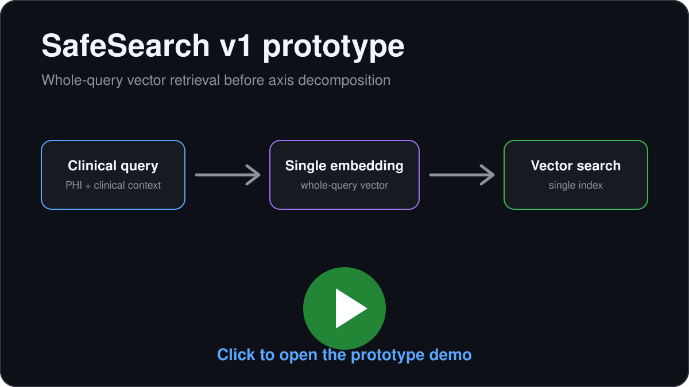

# SafeSearch

**SafeSearch is a privacy-preserving clinical search architecture for connecting BAA-covered clinical LLM environments to external tools such as web search, APIs, and MCP servers.** Major LLM providers shown below, including Microsoft Azure, AWS, Google Cloud, Anthropic, and OpenAI, offer HIPAA-eligible services that can be used under a Business Associate Agreement (BAA), subject to the specific service, account, and configuration. A PHI-bearing query is interpreted inside that BAA-covered environment, decomposed into clinical axes, and mapped by embedding retrieval to an allowlisted vocabulary derived from clinical ontologies such as UMLS, SNOMED CT, and RxNorm. The selected concepts are reranked, ordered, and passed to a separate query builder that never receives the original PHI-bearing text.

> **SafeSearch does not redact the original query and send a modified copy. It constructs a new query from an allowlisted semantic representation.**

**LLMs have fixed knowledge cutoffs determined by their training data. To access current or otherwise unavailable information at inference, they must be augmented with external tools such as web search, APIs, and MCP servers.** In the SafeSearch architecture, those external retrieval services are outside the applicable BAA and therefore must not receive PHI. SafeSearch lets them operate on the reconstructed query, then returns the resulting evidence and citations to the BAA-covered environment as context for the original clinical question at inference.

**Retrieval for representation, followed by retrieval for evidence:**

`PHI-bearing query → clinical axes → allowlisted concepts → reconstructed query → external retrieval → evidence context → inference`

## Why the boundary matters

The [Health Insurance Portability and Accountability Act of 1996 (HIPAA)](https://www.hhs.gov/hipaa/index.html) governs protected health information (**PHI**) handled by covered healthcare organizations and their business associates. A **Business Associate Agreement (BAA)** establishes how a business associate may create, receive, maintain, or transmit PHI on behalf of a covered entity.

The major LLM platforms shown in the boundary figure all provide HIPAA-eligible options under BAAs or covered-service agreements: [Microsoft Azure](https://learn.microsoft.com/en-us/azure/compliance/offerings/offering-hipaa-us), [Amazon Web Services](https://docs.aws.amazon.com/bedrock/latest/userguide/compliance-validation.html), [Google Cloud](https://cloud.google.com/security/compliance/hipaa-compliance), [Anthropic](https://privacy.anthropic.com/en/articles/8114513-business-associate-agreements-baa-for-commercial-customers), and [OpenAI](https://help.openai.com/en/articles/8660679-how-can-i-get-a-business-associate). Coverage is service- and configuration-specific. For example, Google notes that not every model in Model Garden supports HIPAA, and Anthropic notes that its BAA does not necessarily cover features such as web search. [[Google Cloud: HIPAA and generative AI](https://docs.cloud.google.com/architecture/use-generative-ai-utilization-management)] [[Anthropic: BAA for commercial customers](https://privacy.anthropic.com/en/articles/8114513-business-associate-agreements-baa-for-commercial-customers)]

SafeSearch is built for the next boundary: **the external web search, API, or tool used for retrieval is outside the applicable BAA and must not receive the original PHI-bearing query.**

> **PHI can be processed inside an appropriately configured BAA-covered LLM service. External retrieval outside that BAA should receive only the reconstructed query. What representation should cross that boundary?**


HIPAA recognizes two methods of de-identification under [45 CFR § 164.514(b)](https://www.hhs.gov/hipaa/for-professionals/special-topics/de-identification/index.html): **Safe Harbor**, which removes specified identifiers, and **Expert Determination**, which uses statistical and scientific analysis to establish a very small risk of identification.

SafeSearch addresses a related but different engineering problem. Instead of asking only **which parts of the source text should be removed or replaced**, it asks **whether the source representation needs to leave the BAA-covered environment at all**.

That is the basis of **constrained semantic reconstruction**.

## Constrained semantic reconstruction

Conventional de-identification generally produces a modified copy of the source text. SafeSearch produces a new task-oriented representation.

**Redaction**  
`John Smith has leg pain → [NAME] has leg pain`

**Surrogate substitution**  
`John Smith has leg pain → Maria Lopez has leg pain`

**SafeSearch, adversarial trace**

Original PHI-bearing query:

> "guidelines for managing a 47-year-old female who is a Galveston-based vet tech who is also occasionally homeless. She loves Battleship and is a competitive expert. Funny story, we both grew up on the same block on Elderberry street in Dallas! Anyway, can I get some help for her leg pain?"

Reconstructed query sent across the boundary:

> "What treatment options are available for leg pain in an adult female?"

Location, occupation, lifestyle, hobby, and the manufactured shared-block claim were dropped. The reconstruction retained only the task-relevant clinical concepts selected by the pipeline: `intent_terms: treatment`, `anatomy_terms: leg`, `symptom_terms: pain`, `age_bins: adult`, and `sex_terms: female`.

[View the full adversarial trace](docs/traces/mccaffrey-adversarial-challenge-trace.json)

> **The objective is not textual preservation, but preservation of task-relevant clinical semantics across the privacy boundary.**

**Definition.** Constrained semantic reconstruction de-identifies a clinical query by decomposing it into structured clinical concepts, mapping those concepts onto a predefined controlled clinical vocabulary, and reconstructing a new query from the resulting representation rather than modifying PHI spans within the original text.

## Architecture at a glance

Seven stages implement this transformation: interpretation inside the BAA-covered environment, controlled semantic reconstruction at the boundary, external evidence retrieval, and context engineering at inference.

1. **Clinical axis extraction**  
   Azure OpenAI, BAA-covered. Decomposes the clinical query into 16 clinical axes.

2. **Embeddings**  
   Azure OpenAI, BAA-covered. Converts each extracted concept into a semantic vector.

3. **Controlled vocabulary retrieval**  
   PostgreSQL + pgvector, inside the BAA-covered environment. Retrieves the nearest controlled clinical terms for each axis.

4. **Semantic reranking and axis ordering**  
   Azure OpenAI + hybrid score, BAA-covered. Selects the best candidates and determines clinically meaningful ordering.

5. **Safe query reconstruction**  
   Azure OpenAI, BAA-covered. Reconstructs a natural-language search query from the selected controlled terms.

6. **External evidence retrieval**  
   Perplexity `sonar-pro`, external. Retrieves current clinical evidence using the reconstructed query and returns evidence with citations.

7. **Context engineering at inference**  
   Azure OpenAI, BAA-covered. Combines the original clinical query with the returned evidence context packet at the point of inference to generate the clinician-facing answer.

**PHI safety check.** An end-of-pipeline observability layer flags whether known PHI patterns appear in the original query, reconstructed query, or generated answer. See [`app/services/phi_checker.py`](app/services/phi_checker.py).

## Two retrievals

### 1. Retrieval for representation

Inside the BAA-covered environment:

`clinical concept → embedding → pgvector → controlled clinical term`

The purpose is not to retrieve medical evidence. It is to find a controlled clinical representation of the source concept from the curated per-axis vocabulary.

### 2. Retrieval for evidence

After reconstruction:

`reconstructed query → external search → evidence + citations → context packet`

This second retrieval brings current information back into the BAA-covered environment for use at inference.

> [!NOTE]
> **Retrieval for representation, followed by retrieval for evidence.** Conventional retrieval-augmented generation (RAG) retrieves documents or chunks to provide additional knowledge to an LLM. SafeSearch's internal vector retrieval instead retrieves candidate representations used to transform the query itself. Only after that transformation does SafeSearch perform external retrieval, package the returned evidence and citations as context, and provide that context to the original clinical query at inference.

## Technical walkthrough

<details>
<summary><strong>Stage 1: Clinical axis extraction</strong></summary>

The original clinical query is processed inside the configured Azure OpenAI environment. The chat model decomposes the query into 16 clinical axes:

`age_bins`, `allergy_terms`, `anatomy_terms`, `comorbidity_terms`, `diagnosis_terms`, `family_history_terms`, `intent_terms`, `lifestyle_terms`, `procedure_terms`, `race_ethnicity`, `rxnorm_terms`, `severity_status`, `sex_terms`, `symptom_terms`, `temporal_context`, `wordlist_terms`.

Whole-query embedding would collapse everything into a single vector and search for a globally similar sentence. Axis decomposition separates different kinds of clinical information so each can be independently mapped to a controlled representation.

*Example.* A query about "guidelines for a 47-year-old female with leg pain, asking about treatment" is decomposed into roughly `age_bins: [adult]`, `sex_terms: [female]`, `anatomy_terms: [leg]`, `symptom_terms: [pain]`, `intent_terms: [treatment]`.

The extraction call runs at temperature 0.0 with JSON-mode enforced. Post-processing enriches `intent_terms` via a controlled synonym map, normalizes `age_bins` from age or DOB regexes, expands a small set of medication umbrellas into exemplar drugs, and drops substring duplicates. The original query is available at this stage because processing occurs inside the BAA-covered Azure environment.

Sources: [`app/services/axis_extraction.py`](app/services/axis_extraction.py), [`app/core/prompts.py`](app/core/prompts.py) (`AxisExtractionPrompts.SYSTEM_EXTRACTION`), [`app/core/data_mappings.py`](app/core/data_mappings.py).

</details>

<details>
<summary><strong>Stage 2: Embeddings</strong></summary>

> An embedding converts a piece of text into a numerical vector representing features of its semantic meaning. Terms that the embedding model considers semantically similar tend to occupy nearby regions of the embedding space.

Each extracted concept `t` is embedded through the configured Azure OpenAI embedding deployment:

$$E(t) \in \mathbb{R}^{d}$$

Here `t` is an extracted clinical concept, `E` is the embedding model, and `d` is the vector dimensionality. The default configuration in [`.env.example`](.env.example) uses `text-embedding-3-large`; `d` is set by the configured deployment. This is an embedding API call, not generative LLM inference. The model returns a vector rather than a completion. Embedded terms are LRU-cached per process to avoid redundant round-trips.

Source: [`app/services/embeddings.py`](app/services/embeddings.py).

</details>

<details>
<summary><strong>Stage 3: Controlled vocabulary retrieval with PostgreSQL + pgvector</strong></summary>

> pgvector extends PostgreSQL with vector storage and nearest-neighbor search, allowing SafeSearch to ask which stored clinical terms are closest to an extracted concept in embedding space.

Each embedded concept is compared to the terms stored in the corresponding axis table. Each table contains precomputed embeddings for controlled clinical terms. Similarity is cosine similarity:

$$\cos(x,y)=\frac{x\cdot y}{\|x\|\|y\|}$$

Values closer to 1 indicate that the embedding model places the concepts in more similar semantic directions. pgvector implements this through its `<=>` cosine-distance operator; the code returns `1 - (vec <=> qvec)` as the similarity score.

SafeSearch retrieves the top **k = 3** nearest terms per axis at a **cosine threshold of 0.60**. For designated axes, low-similarity retrieval can broaden to the generic `wordlist_terms` table so unusual phrasings can still resolve to the controlled vocabulary.

**The controlled clinical vocabulary is organized into axis-specific vector tables containing clinical terms and their precomputed embeddings. At runtime, SafeSearch retrieves candidate representations from these tables rather than constructing the outbound query directly from the source text.**

Source: [`app/services/vector_search.py`](app/services/vector_search.py).

</details>

<details>
<summary><strong>Stage 4: Semantic reranking and axis ordering</strong></summary>

Vector similarity alone may return a geometrically nearby term that is not the best clinical replacement. SafeSearch therefore scores each candidate along three axes and selects the highest-scoring one per source concept.

$$S_{\text{hybrid}}(t, v \mid q) = w_c \cdot S_{\cos}(t, v) + w_l \cdot \frac{S_{\text{LLM}}(t, v \mid q)}{10} + w_x \cdot S_{\text{lex}}(t, v)$$

The weights in [`RerankingConfig`](app/core/service_configs.py) are `w_c = 0.65`, `w_l = 0.25`, `w_x = 0.10`.

- **Cosine similarity:** Are the concepts close in embedding space?
- **LLM semantic score:** Does this candidate make clinical sense as a representation of the source concept in the context of the original clinician query? The original query is supplied as scoring context; the requested output is a numeric semantic score from 0 to 10.
- **Lexical overlap:** Do the source and candidate literally share words? This is implemented as Jaccard overlap on whitespace-tokenized, lowercased tokens.

For most axes SafeSearch keeps the single top-scoring candidate per source concept. `intent_terms` and `rxnorm_terms` retain up to three because intents and medications can compose into search queries as sets.

Axis ordering is a separate Azure OpenAI chat call. Given the reranked candidates, it asks the model to return the clinically meaningful order of axes for reconstruction. Hybrid-score ordering provides the default ordering when needed.

Sources: [`app/services/reranking.py`](app/services/reranking.py), [`app/core/prompts.py`](app/core/prompts.py) (`RerankingPrompts.SYSTEM_RERANK`, `RerankingPrompts.AXIS_ORDER_SYSTEM`), [`app/core/service_configs.py`](app/core/service_configs.py).

</details>

<details>
<summary><strong>Stage 5: Safe query reconstruction</strong></summary>

This is the key boundary transformation.

**The query builder does not receive the original clinician query.** After candidate selection and axis ordering, it receives the selected clinical representations in axis order and converts them into a natural-language search query.

The Azure OpenAI chat deployment performs the conversion at temperature 0.05 with an 80-token budget and up to three retries. The selected terms can also be rendered directly as an ordered keyword query.

Sources: [`app/services/query_builder.py`](app/services/query_builder.py), [`app/core/prompts.py`](app/core/prompts.py) (`QueryBuilderPrompts.SYSTEM_REFINER`, `QueryBuilderPrompts.REFINEMENT_PROMPT`).

</details>

<details>
<summary><strong>Stage 6: External evidence retrieval</strong></summary>

The reconstructed query is sent to the Perplexity `sonar-pro` chat completion endpoint at temperature 0.1, filtered to a curated set of preferred clinical domains and a rolling one-year publication window. The preferred-domain filter is:

`pubmed.ncbi.nlm.nih.gov`, `jamanetwork.com`, `nejm.org`, `thelancet.com`, `bmj.com`, `annals.org`, `acc.org`, `ahajournals.org`, `escardio.org`, `nice.org.uk`.

The endpoint returns a summary and citation list. SafeSearch treats that returned information as an evidence context packet that can be brought back inside the BAA-covered Azure environment for inference against the original clinical query.

> **Retrieval #1 chooses a representation. Retrieval #2 retrieves evidence for the inference context.**

Source: [`app/services/perplexity.py`](app/services/perplexity.py).

</details>

<details>
<summary><strong>Stage 7: Context engineering at inference</strong></summary>

The evidence returned by external search is brought back inside the BAA-covered Azure environment as a context packet containing the retrieved information and citations. The configured Azure OpenAI chat deployment then receives:

- the original clinician query,
- the selected controlled clinical concepts by axis, and
- the evidence and citations returned by external retrieval.

These inputs are combined at the point of inference to generate the clinician-facing answer. This matters because the model's internal knowledge is bounded by its training data and knowledge cutoff. External tools provide a way to inject current or otherwise unavailable information into the model's context window without sending the original PHI-bearing query to those tools.

> **SafeSearch minimizes what leaves the BAA-covered environment, then maximizes useful context at inference.**

Source: [`app/services/response_generator.py`](app/services/response_generator.py).

</details>

### PHI safety check

After reconstruction and response generation, SafeSearch performs an additional PHI safety check over pipeline outputs using configured PHI patterns and known-PHI terms when available. This operates as a secondary validation layer alongside the primary constrained semantic reconstruction architecture.

Source: [`app/services/phi_checker.py`](app/services/phi_checker.py).

<details>
<summary><strong>Model and BAA-boundary map</strong></summary>

- **Axis extraction:** Azure OpenAI chat deployment. Sees the original query. BAA-covered Azure environment.
- **Concept embedding:** Azure OpenAI embedding deployment. Sees extracted concepts. BAA-covered Azure environment.
- **Semantic candidate rating:** Azure OpenAI chat deployment. Sees the original query as scoring context. BAA-covered Azure environment.
- **Axis ordering:** Azure OpenAI chat deployment. Sees the original query as scoring context. BAA-covered Azure environment.
- **Query reconstruction:** Azure OpenAI chat deployment. Receives ordered controlled terms only, not the original query. BAA-covered Azure environment.
- **External evidence retrieval:** Perplexity `sonar-pro`. Receives the reconstructed query. External to the Azure BAA boundary.
- **Final answer generation:** Azure OpenAI chat deployment. Receives the original query, selected concepts, and returned evidence context packet. BAA-covered Azure environment.

The implementation assumes appropriately configured Azure OpenAI services used under the institution's applicable Microsoft HIPAA BAA and safeguards. Microsoft states that customer prompts, completions, embeddings, and training data for Models sold by Azure are not used to train generative foundation models without permission or instruction. [[Microsoft: Data privacy for Models sold by Azure](https://learn.microsoft.com/en-us/azure/foundry/responsible-ai/openai/data-privacy)]

</details>

<details>
<summary><strong>Prompt index</strong></summary>

- **Axis extraction:** [`AxisExtractionPrompts.SYSTEM_EXTRACTION`](app/core/prompts.py)
- **Semantic candidate rating:** [`RerankingPrompts.SYSTEM_RERANK`](app/core/prompts.py)
- **Axis ordering:** [`RerankingPrompts.AXIS_ORDER_SYSTEM`](app/core/prompts.py)
- **Query reconstruction system prompt:** [`QueryBuilderPrompts.SYSTEM_REFINER`](app/core/prompts.py)
- **Query reconstruction user template:** [`QueryBuilderPrompts.REFINEMENT_PROMPT`](app/core/prompts.py)
- **External retrieval:** inline in [`app/services/perplexity.py`](app/services/perplexity.py)
- **Final answer generation:** [`ResponseGeneratorPrompts.SYSTEM_RESPONSE`](app/core/prompts.py)

</details>

## Semantic fidelity on [ASQ-PHI](https://github.com/JamesWeatherhead/asq-phi)


Cosine similarity between the original clinician query and reconstructed query on the [ASQ-PHI](https://github.com/JamesWeatherhead/asq-phi) benchmark. **100% of Safe Harbor PHI was removed from the reconstructed queries.** Mean cosine 0.61, median 0.63. 4% of queries fall below 0.4. No reconstructed query exceeds 0.83.

This cosine is a proxy for how much task-relevant clinical meaning survives reconstruction. Fidelity and privacy trade against each other; the next section explains why.

## Why not just increase granularity?


Increasing vocabulary granularity can preserve more clinical specificity, but doing so can also preserve rarer combinations of quasi-identifying attributes. Individually none of those is necessarily a Safe Harbor identifier. Jointly they can collapse the k-anonymity cell of the disclosed representation below acceptable thresholds. Coarser vocabulary trades semantic fidelity for k-anonymity headroom. Richer vocabulary trades k-anonymity headroom for semantic fidelity.

This trade-off is formalized in:

> Weatherhead J, Hasan A, Weatherhead J, Golovko G, Grant B, Garcia JD, Certuche HS, Powell RP, Abril JM, McCaffrey P. **K-anonymity decay in multi-turn clinical large language model conversations.** *Frontiers in Digital Health*, 2026. doi:[10.3389/fdgth.2026.1832168](https://www.frontiersin.org/journals/digital-health/articles/10.3389/fdgth.2026.1832168/full).

Headline finding: **79.9% of simulated patients fall below the small-cell threshold ($k < 5$) by the end of their disclosure sequence**, with the median threshold breach at seven disclosure steps, even when every individual conversational turn complies with HIPAA Safe Harbor de-identification.

## v1 prototype

Before axis decomposition, v1 vectorized whole queries against a single embedding index. It had no principled way to separate clinical concepts from surrounding identifying context.

[](https://raw.githubusercontent.com/JamesWeatherhead/SafeSearch/main/docs/assets/safesearch-prototype-v1.mov)

**[Open the full v1 prototype demo](https://raw.githubusercontent.com/JamesWeatherhead/SafeSearch/main/docs/assets/safesearch-prototype-v1.mov)**

## Repository layout

```text
app/
├── main.py                       FastAPI, GET /query, Scalar at /scalar
├── worker.py                     SAQ queue (DummyQueue for PoC)
├── core/                         config, prompts, service configs, regex
├── db/                           Tortoise ORM
└── services/
    ├── pipeline.py               orchestrator
    ├── axis_extraction.py        stage 1
    ├── embeddings.py             stage 2 (Azure embeddings + LRU cache)
    ├── vector_search.py          stage 3
    ├── reranking.py              stage 4 (rerank + axis ordering)
    ├── query_builder.py          stage 5 (safe query reconstruction)
    ├── perplexity.py             stage 6
    ├── response_generator.py     stage 7
    └── phi_checker.py            end-of-pipeline PHI safety check
docker/, scripts/init-db.sql, docs/{assets,traces}
```

## Quickstart

```bash
uv sync
docker compose -f docker/compose.yaml up -d
cp .env.example .env    # Azure OpenAI, Perplexity, Postgres
uv run python manage.py work
open http://localhost:8000/scalar
```

## Configuration

Settings load from `.env` via `pydantic-settings`. See [`app/core/config.py`](app/core/config.py) for the full schema.

- **Azure OpenAI:** key, endpoint, API version, chat + embedding deployment names, chat + embedding model names.
- **Perplexity:** `PPLX_API_KEY`, `PPLX_API_ENDPOINT`.
- **PostgreSQL:** `DB_HOST`, `DB_PORT`, `DB_NAME`, `DB_USERNAME`, `DB_PASSWORD`, `DB_CONNECT_TIMEOUT`, `DB_DSN`.
- **PHI dictionary path:** `PHI_QUERIES_FILE` (optional; regex-only if absent).
- **Environment name:** `ENVIRONMENT`.

Pipeline tunables such as rerank weights, top-k, cosine threshold, retrieval broadening, response temperatures, and PHI strictness live in [`app/core/service_configs.py`](app/core/service_configs.py).

## Attribution

**James Charl Weatherhead · Jake Craig Weatherhead · Peter A. McCaffrey, MD (PI)**

- Benchmark: [ASQ-PHI](https://github.com/JamesWeatherhead/asq-phi)
- Paper: [K-anonymity decay, *Frontiers in Digital Health*, 2026](https://www.frontiersin.org/journals/digital-health/articles/10.3389/fdgth.2026.1832168/full)

## License

Proprietary. See [`pyproject.toml`](pyproject.toml).